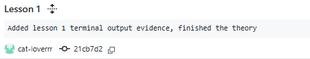
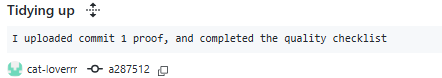
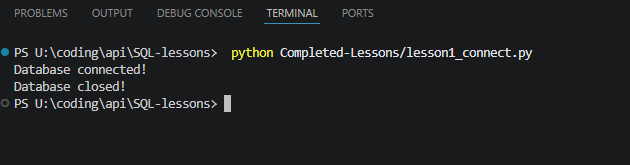

# Lesson 01 Evidence Pro-Forma

## Commit evidence (minimum 2)
- Commit 1 hash + message: 

- Commit 2 hash + message: 

- Optional Commit 3 hash + message:

## Run evidence
- Command run (example: `python lesson1_connect.py`):
- Terminal output pasted below:

## What I changed from the starter example
- I entered something else into the terminal rather than what we were provided

## Error and fix
- Error I hit: File lesson1_connect.py not found by terminal
- How I fixed it: Failed to refer to the file properly, needed to write 'python Completed-Lessons/lesson1_connect.py'

## Understanding check (answer in your own words)
1. What is the difference between Python and SQLite?
SQLite is a lightweight database engine that stores data in a single file, whilst Python can talk to SQLite. 
2. What file was created when the script ran?
school.db
3. What does the connection do?
Connects to the database and creates a file
## Quality checklist
- [☑] Script runs without unhandled errors
- [☑] I included at least 2 lesson commits
- [☑] I included terminal evidence
- [☑] I answered all questions in my own words
